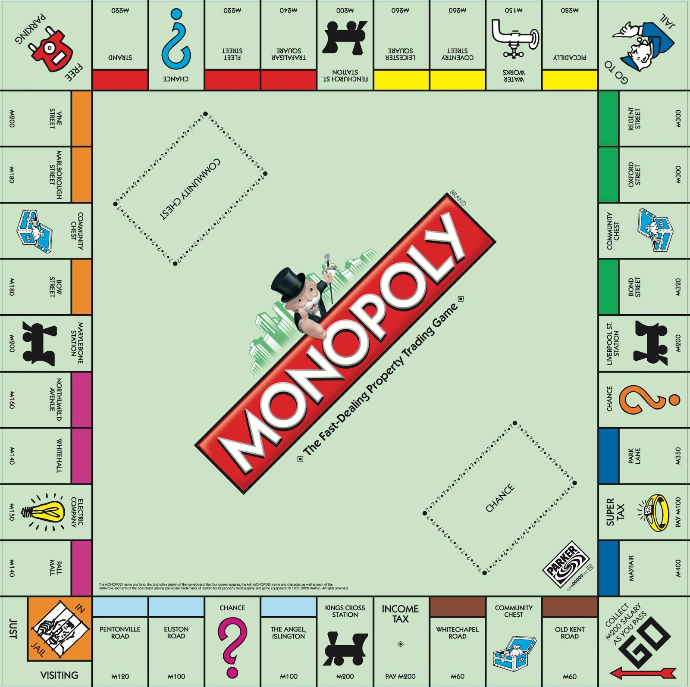

# Monopoly

{:.inline}{: style="width:50%"}

Bij banken, verzekeraars en het centraal planbureau worden modellen opgesteld die 
onze economie beschrijven. Alle facetten die een rol spelen krijgen een plek en met 
behulp van een computer worden verschillende scenario's doorgerekend (gesimuleerd) 
om zo risico's in te schatten bij bepaalde gebeurtenissen of om het effect van
nieuwe maatregelen te onderzoeken. 

Door de onderlinge afhankelijkheid van de parameters in dat soort modellen wordt het 
al snel ondoenlijk om het met de hand door te rekenen. Zeker als het effect van 
maatregelen een random component heeft. Met behulp van een computer gaat dat snel en 
kan je zelfs de settings vinden waarin je dingen kan optimaliseren: dat kan het 
maximaliseren van je winstkansen zijn, maar ook het minimaliseren van de kans dat 
je failliet gaat. Of een mix van die scenario's.

In deze module gaan we een voorbeeld doorrekenen: Monopoly met twee spelers, 
waarbij we stap voor stap meer complexiteit toevoegen. Voor degene die de smaak te 
pakken heeft en nu al droomt van een baan op de Risk-Analysis divisie van JP Morgan 
hebben we nog wat suggesties voor extra opgaves gemaakt.

## Getting started

Bij deze opdracht leveren we wat code mee, zodat jij niet al het werk hoeft te doen. De code kun je [hier downloaden](https://github.com/Jelleas/monopoly/archive/master.zip).
Let er even op, het is een .zip bestand. Deze moet je dus uitpakken in de map waarin je wilt gaan werken. 

Zodra je dat hebt gedaan zie je drie python bestanden: `monopoly.py`, `monopolyData.py`, en `monopolyVisualisation.py`. De code binnen deze files hoef je niet te begrijpen.
Toch even voor een snelle uitleg, monopolyVisualisation is een Python module die de visualisatie verzorgt, en monopolyData een module die de data levert voor de
waardes en namen van de vakjes op het bord. `monopoly.py` geeft jou de mogelijkheid om een pion over het bord te laten lopen.

Zullen we het even testen? Doe maar eens:

	python monopoly.py

Als alles goed is, zie je een pionnetje over het Monopolybord bewegen. Dit is wat we jou meegeven, een representatie voor een bord, een representatie voor een pion, en de 
mogelijkheid een pion over het bord te laten bewegen. Ook kun je dit visualiseren, zo kan jij zometeen makkelijk nagaan of jouw simulatie wel klopt.

Hoe werkt dit alles? In monopoly.py geven we je twee nieuwe classes. Dat zijn `Board`, en `Piece`. Dit zijn zelfgemaakte (door ons) types waarmee jij zometeen kan werken.
Je kan een `Board` aanmaken met de volgende regel code:

	import monopoly
	board = monopoly.Board()

En een `Piece` als volgt:

	piece = monopoly.Piece()

Let wel, dat wat voor het `=` teken staat is ook maar een naam, dat kan natuurlijk ook anders heten! We moeten als we in een ander bestand dan monopoly.py gaan
programmeren eerst `monopoly` importeren d.m.v. `import monopoly`. In Python zijn losse bestanden zogenaamde modules, welke je d.m.v. `import` kan importeren.
Door de bovenstaande code hebben we een `Board` en een `Piece`. Een `Board` heeft twee attributen: `names`, en `values`. Dit zijn lijsten van 40 lang, met alle
namen en waardes op de vakjes van het bord. Zo is `board.names[0]` de string `"start"`, met bijbehorende waarde `board.values[0]` van 0. Een `Piece` heeft één
attribuut: `location`. `location` is een integer die de plek op het bord aangeeft, alle `Piece`s beginnen op location 0. Ook heeft `Piece` een methode, een functie
behorende bij een class, namelijk `move(distance)`. Je kan een `Piece` dus laten bewegen d.m.v. de methode `move(distance)`, bijvoorbeeld `piece.move(7)` beweegt
de pion 7 vakjes. Door het gebruik van deze methode verandert de waarde van het attribuut location ook. 

Met de combinatie van een `Board` en een `Piece` kunnen we het spel simuleren. Je kan namelijk de waarde opvragen van het vakje waar de `Piece` op staat d.m.v.
`board.values[piece.location]` en de naam d.m.v. `board.names[piece.location]`. Wil je de stand van het bord zien? Gebruik dan de `draw` functie van `monopoly.py`.
Deze kun je gebruiken als volgt:

	monopoly.draw(board, piece)

Mocht je meerdere `Piece`s hebben, dan kun je dit doen:

	monopoly.draw(board, piece1, piece2, piece3)

Wellicht wil je `draw` meerdere keren gebruiken om een animatie te maken, je zal dan waarschijnlijk merken dat je computer iets te snel is om het pionnetje nog 
te kunnen volgen. Maak dan gebruik van de `sleep()` functie van de module `time`. Bijvoorbeeld als volgt:

	import time
	monopoly.draw(board, piece)
	time.sleep(1)

Bovenstaande zorgt ervoor dat je een seconde de tijd krijgt voordat jouw programma weer doorraast :-)

## Opdracht 1: Trump mode: 1 speler met oneindig veel geld

We gaan een groot aantal potjes Monopoly simuleren waarin we 1 speler rond laten lopen en hem 
straten laten kopen. We spelen in de zogenaamde Trump-Mode. De speler heeft oneindig veel geld, 
en er is geen concurrentie. We houden het spel simpel, er zijn geen huizen of hotels, alleen ongekochte of gekochte straten, stations en nutsbedrijven.
Kanskaarten negeren we even, en niemand gaat direct naar de gevangenis. 
Doel van deze opdracht is om te bepalen wat het gemiddeld aantal worpen is waarna alle straten 
zijn verkocht. Hier gaan we in stappen naar toe werken. 

### Tussenstap 1: Dobbelstenen

Maak een nieuw bestand aan genaamd
`monopolySimulatie.py`. Zorg dat de gedownloade bestanden in dezelfde map staan. 
Schrijf een functie `dobbelstenenWorp()` binnen `monopolySimulatie.py`. De functie
moet geen argumenten accepteren, en de uitkomst van de dobbelstenen worp als integer
returnen. Let op, binnen Monopoly heb je als speler twee dobbelstenen! Zo heb je de meeste
kans om 7 te gooien, en kun je 1 helemaal niet gooien. Om deze functie te implementeren kun je
gebruik maken van de functie `randint()` van de `random` module. Google maar!

### Tussenstap 2: Rondlopen

Nu we dobbelstenen hebben kunnen we rondlopen op het bord. Om het aan jezelf te bewijzen, loop een rondje, 
en stop zodra je weer voorbij start bent (positie 0). Print na elke zet (dobbelstenen worp) het naam van het vakje
en de waarde van het vakje waar de pion op staat. Zoiets:

	Na worp 0: brink, 60
	Na worp 1: velperplein, 120
	Na worp 2: neude, 180
	...
	Na worp 7: Dorpsstraat, 60

### Tussenstap 3: Bezit

Rondlopen is één ding, maar we willen straks ook straten, stations en nutsbedrijven kunnen kopen. We hebben dus iets 
nodig om bezit te onthouden. Simpelweg een lijst zou hiervoor onhandig zijn, want sommige vakjes kun je niet kopen.
Hier kunnen we handig een dictionary gebruiken. Waar we de namen van de vakjes kunnen gebruiken als keys, en daaraan
als value kunnen koppelen of ze al gekocht zijn of niet (een boolean). Als we dan enkel de namen van de vakjes die je
kan kopen in de dictionary stoppen, kunnen we straks heel makkelijk controlleren hoeveel er al is gekocht!

Om te beginnen hebben we een dictionary nodig, en moeten we deze vullen met alle namen van vakjes welke je kan kopen.
Dit zijn de vakjes met een waarde (anders gezegd, alle vakjes met een waarde hoger dan 0). Dit is jouw taak: maak een
dictionary genaamd `bezit`, met alle vakjesnamen met een waarde hoger dan 0 als keys, en alle values met waarde `False`.

### Tussenstap 4: Trump

### Tussenstap 4: Enkel potje: rondlopen op het 'echte' bord (met kopen)

We gaan nu de functie `simuleer_potje_Monopoly()` uitbreiden zodat we ook straten kunnen kopen en daarbij 
bijhouden welke straten er wel/niet zijn verkocht. We beginnen daarmee door in de zogenaamde Donald Trump 
mode over het bord te stappen: we kunnen alles kopen, zijn de enige speler in het spel en we wandelen net 
zo lang door tot we alles in ons bezit hebben. De vraag die we in deze opdracht willen beantwoorden is de 
volgende: "hoe lang (hoeveel worpen) duurt het voor we alle straten in ons bezit hebben?".

Het is hierbij cruciaal dat we bijhouden hoeveel straten (en welke) we al in ons bezit hebben. Dit kunnen we 
doen met behulp van een lijst (weer lengte 40) waarbij je voor elke plek op het bord bijhoudt of hij in het 
bezit is van de speler. Of niet. Die lijst begint als een lijst met 40 nullen. 

{: .language-python}
    bezittingen = [0,0,0,0,.....,0,0]

Elke keer als je op een nieuwe positie komt kan je nu nagaan:

  - is er op die positie iets te koop: straat, station, water/electriciteit ?
  - zo ja, is het nog 'op de markt'?
   
Als je bijvoorbeeld na worp 1 op plek 3 komt en whitechapel road (of Brink in de Nederlandse versie) koopt 
kan je je lijst met bezittingen updaten. Gelijk erna ziet hij er dan zo uit:

{: .language-python}
    bezittingen = [0,0,1,0,.....,0,0]

Als er op de positie niks te koop is of als je de straat al in je bezit hebt dan gooien we gewoon 
opnieuw en wandelen we verder. Zorg dat je na elke worp waarbij je op een veld komt dat nog te koop 
is het op het scherm geprint wordt en ook gelijk hoeveel velden je in totaal in je bezit hebt na die 
aankoop.

{: .language-python}
	Na worp 1: positie  3 (straat).
	           speler 1 heeft 1 huis in zijn/haar bezit. Er staan nu nog 27 velden te koop.

Omdat je weet hoeveel straten er in totaal te koop zijn in het spel weet je nu ook wanneer je alle 
straten in je bezit hebt. Stop met gooien als dat gebeurt en print op het scherm hoeveel beurten je 
nodig had:

{: .language-python}
    Monopoly is afgelopen: na worp XXX had de speler alle straten in zijn bezit

### Tussenstap 5: Meerdere potjes: gemiddeld aantal worpen tot einde spel

We hebben met de functie `simuleer_potje_Monopoly()` die we in tussenstap 1-4 gemaakt hebben nu 
de mogelijkheid om een enkel potje Monopoly te simuleren. Als je dit een paar keer doet zul je 
zien dat het aantal worpen dat je nodig hebt om alle straten in je bezit te krijgen sterk varieert 
omdat je aan het eind van het spel natuurlijk maar net op dat laatste overgebleven vakje terecht 
moet komen. Het doel van deze opdracht was om uit te zoeken hoeveel worpen de speler *gemiddeld* 
nodig zou hebben om alle velden in zijn bezit te krijgen. Om deze vraag te beantwoorden zullen we 
een groot aantal potjes moeten simuleren zodat we daarvan het gemiddeld aantal worpen kunnen bepalen.

Schrijf een functie `simuleer_groot_aantal_potjes_Monopoly()` die, de naam zegt het al, een groot aantal potjes 
kan simuleren door steeds de functie `simuleer_potje_Monopoly()` aan te roepen. Pas ook de functie 
`simuleer_potje_Monopoly()` zo aan dat hij als return value het aantal worpen van het potje teruggeeft. Begin 
met 1 potje en voer dat dan op naar 2, 10 en uiteindelijk naar 10000 als je er zeker van bent dat je programma 
goed werkt. Hou voor elk potje bij (in een lijst) hoeveel worpen er nodig waren om alle straten in bezit te 
krijgen en maak daarvan een grafiek (histogram) als alle potjes gesimuleerd zijn. Bepaal op dat moment ook het 
gemiddeld aantal worpen dat nodig was om alle straten in je bezit te krijgen en print het op het scherm in het 
format dat aan het begin van de opgave gespecificeerd was:

{: .language-python}
	Monopoly simulator: 1 speler, Trump mode 
    We hebben 10000 potjes gesimuleerd
    Gemiddeld duurde het XXX worpen voor de speler alle straten in zijn bezit had

Tip: als je een groot aantal potjes simuleert is het handig als het programma laat zien waar 
hij mee bezig is. Als er niks te zien is op het scherm vraagt de gebruiker zich anders af: 
"moet ik nog 1 minuut wachten of nog 1001 uur ? Een manier om dat op te lossen is bijvoorbeeld 
door elke 500 potjes even naar het scherm te printen dat je nu Monopoly-potje X van in totaal 
Y potjes aan het simuleren bent.
 
 
