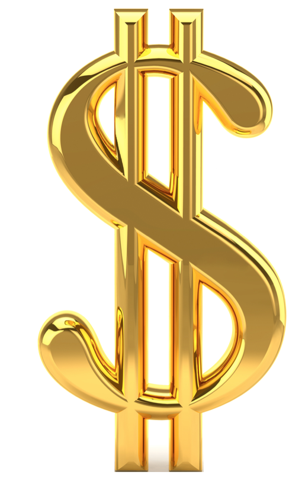

## Opdracht 2: Startgeld

{:.inline}{: style="width:20%"}

In een normaal potje Monopoly krijg je 1500 euro startgeld en verdien je 200 euro elke   
keer dat je start passeert. Zo'n eindige hoeveelheid startgeld heeft invloed op de snelheid 
waarmee je nieuwe straten kan kopen. In deze opdracht zoeken we uit welk effect dit precies 
heeft.

Maak een nieuw bestand aan genaamd monopolyStartgeld.py binnen dezelfde map als de vorige opdracht.
Simuleer nu Monopoly spellen met een variabele hoeveelheid startgeld in stappen van 500 euro, startend bij 0 euro, oplopend t/m 2500 (inclusief!).
Elke keer dat de pion start passeert krijgt de speler 200 euro extra. 
Maak een grafiek met op de x-as de verschillende hoeveelheden startgeld, en op de y-as het aantal worpen totdat alles is opgekocht.

Om te voorkomen dat je code moet kopieren, kun je gebruik maken van `if __name__ == "__main__"` in monopolyTrump.py. Zo kun je 
code importeren, zonder dat er code wordt uitgevoerd.

Begin met 3000 euro startgeld en verlaag dat steeds met 500 euro: 2500, 2000, 1500, 1000, 500 
tot 0 euro. Simuleer voor elke keuze van het startgeld 10000 potjes om zo nauwkeurig mogelijk 
het gemiddeld aantal worpen te bepalen dat nodig is om alle straten te kopen en maak uiteindelijk 
een grafiek van het gemiddeld aantal worpen als functie van de hoeveelheid startgeld. 

In het officiele Monopolyspel krijgt elke speler 1500 euro. Print voor die specifieke 
hoeveelheid startgeld het aantal worpen dat je nodig hebt om alle straten te kopen en 
print dat als volgt op het scherm:

{: .language-python}
	Monopoly simulator: 1 speler, 1500 euro startgeld, 10000 potjes
    Gemiddeld duurde het XXX worpen voor de speler alle straten in zijn bezit had
    
Gebruik het verschil tussen het gemiddeld aantal worpen met 1000 euro of 2000 euro startgeld 
om een idee te krijgen wat het effect is (aantal worpen dat het spel er korter/langer over 
doet) voor elke 100 euro meer of minder stargeld.

Een paar tips bij deze opdracht:

   1. Je mag de hoeveelheid startgeld in deze opdracht steeds met de hand aanpassen.

   2. Je kan je code testen door de speler een enorme hoeveelheid startgeld mee te geven. Met 1
      miljoen euro creeer je namelijk effectief eenzelfde situatie als in opdracht 1 waarin 
	  geld geen rol speelde.

 
	